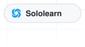
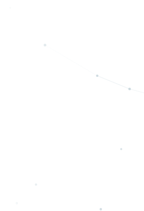
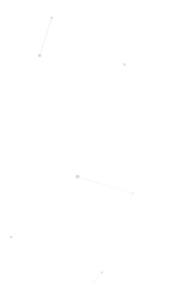
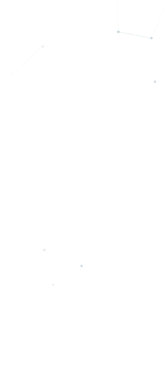
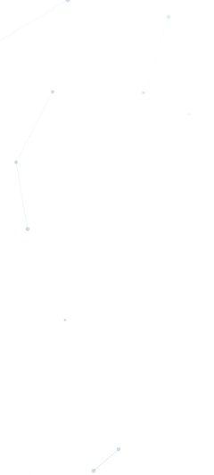
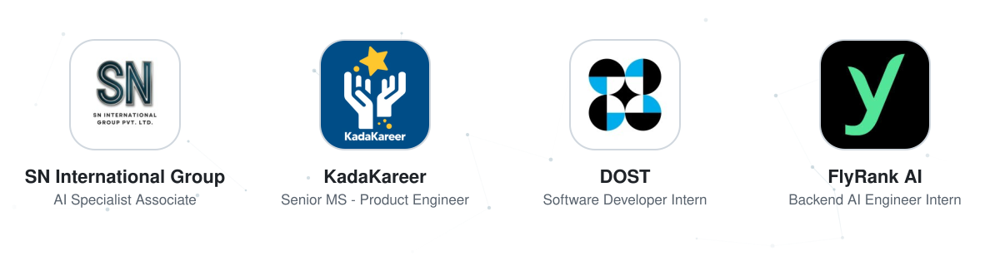

<h1>
  <picture><source
    media="(prefers-color-scheme: dark)"
    srcset="assets/header-dark.svg"></picture> 
  <picture><source
    media="(prefers-color-scheme: dark)"
    srcset="assets/header-left-dark.svg"></picture><!--
  --><a href="https://www.linkedin.com/in/nicko-james-barata"><picture><source
    media="(prefers-color-scheme: dark)"
    srcset="assets/header-linkedin-dark.svg"></picture></a><!--
  --><a href="mailto:nickobarata07@gmail.com"><picture><source
    media="(prefers-color-scheme: dark)"
    srcset="assets/header-email-dark.svg"></picture></a><!--
  --><a href="https://www.sololearn.com/en/profile/20283378"><picture><source
    media="(prefers-color-scheme: dark)"
    srcset="assets/header-sololearn-dark.svg"></picture></a><!--
  --><picture><source
    media="(prefers-color-scheme: dark)"
    srcset="assets/header-right-dark.svg"></picture>
</h1>

  <picture><source
    media="(prefers-color-scheme: dark)"
    srcset="assets/stage-top-dark.svg"></picture> 
  <picture><source
    media="(prefers-color-scheme: dark)"
    srcset="assets/stage-streak-left-dark.svg"></picture><!--
  --><!--
  --><picture><source
    media="(prefers-color-scheme: dark)"
    srcset="assets/stage-streak-right-dark.svg"></picture> 
  <picture><source
    media="(prefers-color-scheme: dark)"
    srcset="assets/stage-gap1-dark.svg"></picture> 
  <picture><source
    media="(prefers-color-scheme: dark)"
    srcset="assets/stage-city-left-dark.svg"></picture><!--
  --><!--
  --><picture><source
    media="(prefers-color-scheme: dark)"
    srcset="assets/stage-city-right-dark.svg"></picture> 
  <picture><source
    media="(prefers-color-scheme: dark)"
    srcset="assets/stage-gap2-dark.svg"></picture> 
  <picture><source
    media="(prefers-color-scheme: dark)"
    srcset="assets/stage-tech-dark.svg"></picture>

  <picture><source
    media="(prefers-color-scheme: dark)"
    srcset="assets/divider-dark.svg"></picture>

  <picture><source
    media="(prefers-color-scheme: dark)"
    srcset="assets/recognition-dark.svg"></picture>

<!--
## 🤝 Shipped with

  <picture><source
    media="(prefers-color-scheme: dark)"
    srcset="assets/partners-dark.svg"></picture>

-->

  <picture><source
    media="(prefers-color-scheme: dark)"
    srcset="https://capsule-render.vercel.app/api?type=waving&section=footer&height=110&color=0:0d1117%2C55:0b3a52%2C100:00a8cc"></picture>

