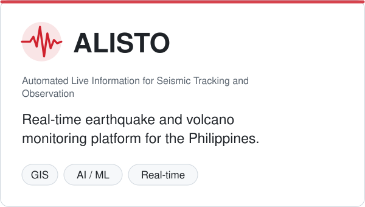
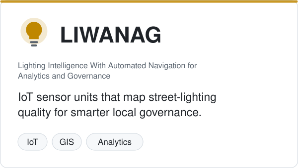
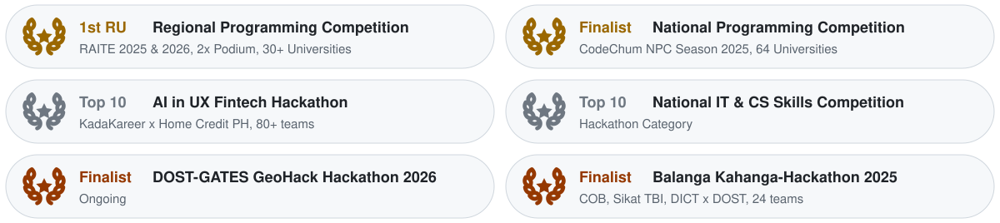

# <picture><source media="(prefers-color-scheme: dark)" srcset="assets/header-dark.svg"></picture> <picture><source media="(prefers-color-scheme: dark)" srcset="assets/header-left-dark.svg"></picture><a href="https://www.linkedin.com/in/nicko-james-barata"><picture><source media="(prefers-color-scheme: dark)" srcset="assets/header-linkedin-dark.svg"></picture></a><a href="mailto:nickobarata07@gmail.com"><picture><source media="(prefers-color-scheme: dark)" srcset="assets/header-email-dark.svg"></picture></a><a href="https://www.sololearn.com/en/profile/20283378"><picture><source media="(prefers-color-scheme: dark)" srcset="assets/header-sololearn-dark.svg"></picture></a><picture><source media="(prefers-color-scheme: dark)" srcset="assets/header-right-dark.svg"></picture>

<picture><source media="(prefers-color-scheme: dark)" srcset="assets/stage-top-dark.svg"></picture> <picture><source media="(prefers-color-scheme: dark)" srcset="assets/stage-streak-left-dark.svg"></picture><picture><source media="(prefers-color-scheme: dark)" srcset="assets/stage-streak-right-dark.svg"></picture> <picture><source media="(prefers-color-scheme: dark)" srcset="assets/stage-gap1-dark.svg"></picture> <picture><source media="(prefers-color-scheme: dark)" srcset="assets/stage-city-left-dark.svg"></picture><picture><source media="(prefers-color-scheme: dark)" srcset="assets/stage-city-right-dark.svg"></picture> <picture><source media="(prefers-color-scheme: dark)" srcset="assets/stage-gap2-dark.svg"></picture> <picture><source media="(prefers-color-scheme: dark)" srcset="assets/stage-tech-dark.svg"></picture> <picture><source media="(prefers-color-scheme: dark)" srcset="assets/stage-bottom-dark.svg"></picture>

## 🚀 Featured projects

<picture><source media="(prefers-color-scheme: dark)" srcset="assets/projects-top-dark.svg"></picture> <picture><source media="(prefers-color-scheme: dark)" srcset="assets/projects-fill-a-dark.svg"></picture><a href="https://github.com/noteve07/ALISTO"><picture><source media="(prefers-color-scheme: dark)" srcset="assets/card-alisto-dark.svg"></picture></a><picture><source media="(prefers-color-scheme: dark)" srcset="assets/projects-fill-b-dark.svg"></picture><a href="https://github.com/noteve07/LIWANAG"><picture><source media="(prefers-color-scheme: dark)" srcset="assets/card-liwanag-dark.svg"></picture></a><picture><source media="(prefers-color-scheme: dark)" srcset="assets/projects-fill-c-dark.svg"></picture> <picture><source media="(prefers-color-scheme: dark)" srcset="assets/projects-bottom-dark.svg"></picture>

<b>Earlier work</b>

 

- [ReadMe](https://github.com/noteve07/mvc-readme-website): e-library portal with an admin dashboard and book recommendations (group project, OOP finals).
- [ProduX](https://github.com/noteve07/produx-2nd-final-project): second-year Java final project, built as lead programmer.
- [VibeSwift](https://github.com/noteve07/vibeswift-1st-final-project): Java console app for concert seat reservations with an ASCII stadium seat map.
- [MusicBox](https://github.com/noteve07/musicbox-console): C# console instrument shop that demonstrates core OOP concepts.
- [HRRN Scheduler](https://github.com/noteve07/g4-hrrn-algorithm-project): Java implementation of the Highest Response Ratio Next CPU scheduling algorithm.
- [Python One-Liners](https://github.com/noteve07/python-one-liners): single-line Python puzzles written for fun.

## 🏆 Awards & recognition

  <picture><source media="(prefers-color-scheme: dark)" srcset="assets/recognition-dark.svg"></picture>

<b>View all awards</b>

 

  <picture><source media="(prefers-color-scheme: dark)" srcset="assets/awards-all-dark.svg"></picture>

## 🤝 Shipped with

  <picture><source media="(prefers-color-scheme: dark)" srcset="assets/partners-dark.svg"></picture>

